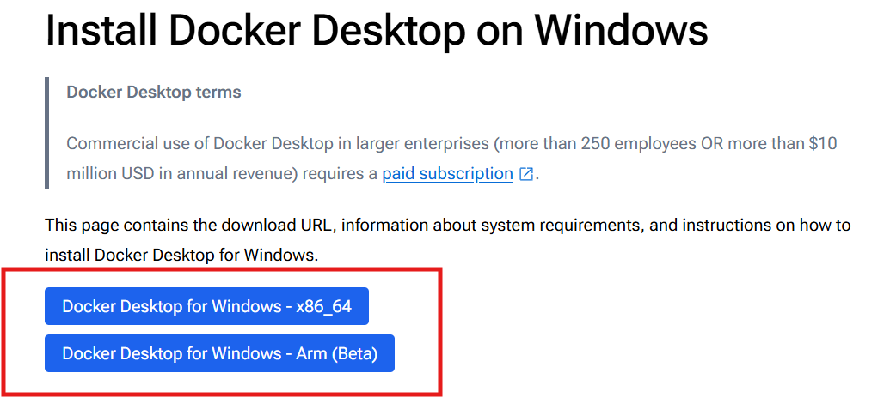

# Kafka Using Docker
This repository demonstrates how to use kafka using docker on a **Windows** OS.

---
#### Steps to Download, Install & Configure Docker on Windows OS:

1. [Download Docker Desktop for windows](https://docs.docker.com/desktop/setup/install/windows-install/)
Choose based on your system requirements. Although, I'd suggest you to select first one.


2. Once downloaded, install it.

3. After installing, we have to set some configurations for proper working of Docker in Windows. You can refer [this](https://docs.docker.com/desktop/setup/install/windows-install/#system-requirements) as well.

    a. First, type `wsl` in the command prompt to check whether you've wsl available in your system or not.

    b. *If its available* it would open bash like interface in your command prompt.

    c. *If not*, then install it using `wsl --install`.

    d. Then, go to *Settings* and search for **Windows Features** and then make sure that `Virtual Machine Platform` and `Hyper-V` is checked.

    e. Lastly, go to *Task Manager* > *Performance Tab* and see whether Virtualization is `Enabled` or not.
    
    d. *If yes*, then you're good to go. *Otherwise*, you have to go to your BIOS and enable it from there.

That's it! Now you have configured **Docker** on your Windows Machine.

---

## Measures you need to follow for running any Kafka Application on Docker. 

1. Create a Folder in your System

2. Create a `docker-compose.yml` file. This file contains the configuration of the services/images that you'll be using in a container.
    A sample structure would look like as follows:
    ```yaml
    version: 'some_number'
    services:
        service_name_1:
            container_name: "the_name_of_this_container"
            image: "the_image_we_are_pulling_from_docker_hub"
            ...
            ...
        
        service_name_2:
            container_name: "the_name_of_this_container"
            image: "the_image_we_are_pulling_from_docker_hub"
            ...
            ...
    ```
    The above yaml file showcases how `docker-compose` file is being set, how the services and their configurations are maintained.

3. *Open/Start* the `Docker Desktop App`, this is an **important** step as failing to do this would not start any containers.

4. Once you've added all the services in your `docker-compose` file, you have to start the container so that the container is in running state and all the images/services in it are in running state. 
To do that we have to run a command: `docker-compose up -d`. 
This will start the container.
You can verify it by opening the Docker Desktop App and visiting *Containers* Tab.
You can also see the images you've pulled from your     `docker-compose` file in the *Images* tab.

5. Above are the necessary steps to do for starting the container and the services in it. Then, based on the other requirement you can proceed further.

---

## Practical Implementation

1. **[Bulk Transfer from MySql to MySql](https://github.com/RahulRoy-rsp/Kafka_On_Docker/tree/main/Use_Case_1)** *(mode=bulk)*
2. **[Incremental Transfer from MySql to MySql](https://github.com/RahulRoy-rsp/Kafka_On_Docker/tree/main/Use_Case_2)** *(mode=incrementing)*
3. **[CDC using Debezium](https://github.com/RahulRoy-rsp/Kafka_On_Docker/tree/main/Use_Case_2)** *(capturing from postgres)*
